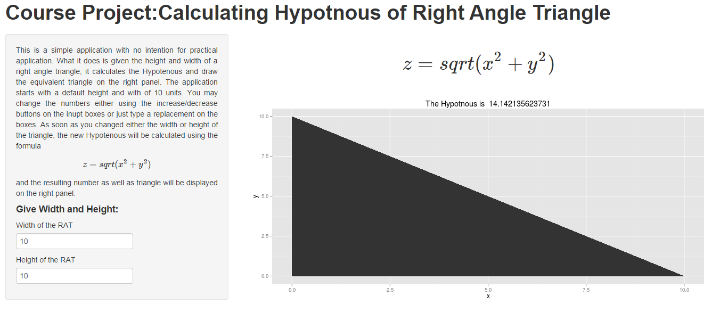

## What it is?


1. It is a shiny application deployed in shinyapps.io
2. It calculates the Hypotenuse of a right angle triangle,  and also displays a plot of the triangle to help users to decide.
3. It expects Height and Width (default value of 10 units is given for both)
4. As users change height, width or both, the hypotenuse is automatically calculated and a coresponding triangle will be shown on the left panel.
5. The applicaton can be found in [shinyapps.io] (https://yosephmekasha.shinyapps.io/calulating-hypoteneus/)
6. The Souce code can also be downloaded from [Github](https://github.com/YosephM/calulating-hypoteneus)

--- .class #id 

## What does it look like?



--- .class #id 

## How is it written? - ui.R
```{r message=FALSE,eval=FALSE}
# ui.r
library(shiny)
shinyUI(
  pageWithSidebar(
      headerPanel("Course Project:Calculating Hypotenuse of Right Angle Triangle"),  
      sidebarPanel(   
        p( align="justify","This is a simple ... [I have cut the text here to fit it into the slid ... please look at the source] . "),
        h4("Give Width and Height:"), 
        numericInput('x','Width :',10, min=0, max=500,step=1),
        numericInput('y','Height :',10, min=0, max=500,step=1)
        ),   
      mainPanel(
        h2(withMathJax("$$ z= sqrt(x^2 + y^2)$$")),
        plotOutput('RAT')  
      
              )
      )
  )
```

--- .class #id

## How is it written? - server.R
```{r essage=FALSE,eval=FALSE}
# server.R
library(shiny)
library(ggplot2)
library(data.table)
shinyServer(
  function(input,output)
  {  
    output$RAT<- renderPlot(
      {     
      dt <- data.table( x = c(0,0,{as.numeric(input$x)}), y = c(0,{as.numeric(input$y)},0))
      z<- sqrt(input$x^2 + input$y^2)      
      ggplot() + 
      geom_polygon(data = dt ,aes( x=x ,y=y ) ) + 
      ggtitle(paste("The Hypotnous is ",z) ) + ylim(0,max(c(input$x,input$y)) ) + xlim(0,max(c(input$x,input$y)) )
     }
    )  
    
  }
)
```
--- .class #id